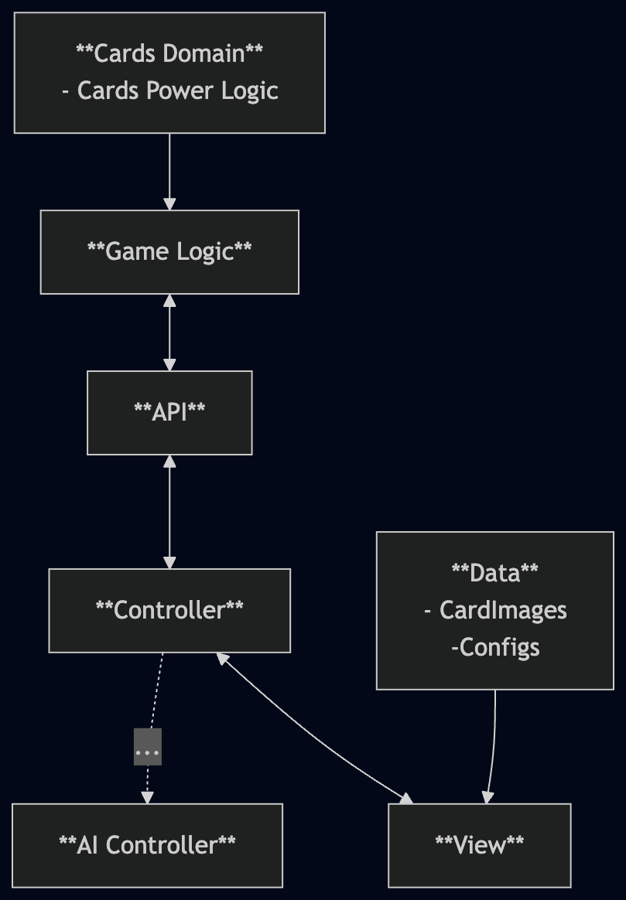

# Card War

### Description
Simple implementation of war card game in Unity. Game is using client server architecture with second player simulated as CUP.

### Setup
- clone repository
- open project in Unity
- open GameScene

### Configuration
- various timings can be configured in configuration files stored in Assets/ScriptableObjects
- by default game uses minimal deck for quick testing, to use full deck uncheck bool in GameController object on the GameScene

### Controlls
- just click on the screen :)

### Architecture

### Design and implementation choices:
- start off development with pure C# game logic
- make comprehensive unit test suite to make sure game works as it should before implementing visuals
- command-based server client communication for easy to controll animations and easily-defined visual actions
- usage of sprite atlases for batching and rendering optimizaitons
- use of pooling for object creation and recycling to save resources
- pre-allocation memory where possible to avoid runtime performance issues

### Dependencies
- [PrimeTween] (https://github.com/KyryloKuzyk/PrimeTween)

#### Unity Version
2022.3.21